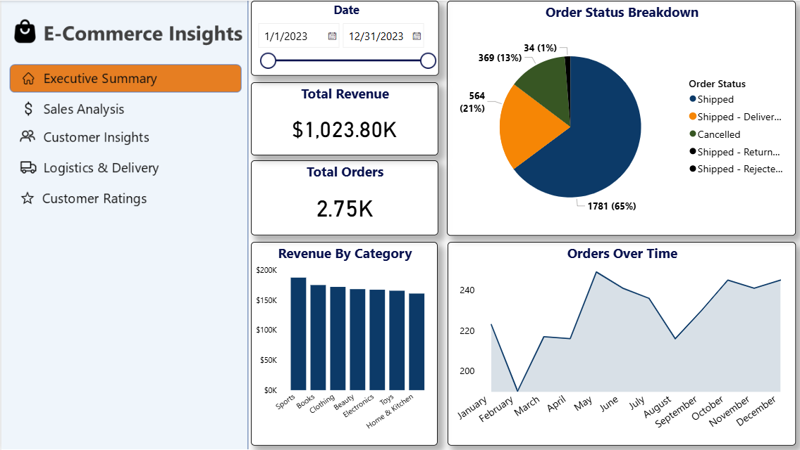
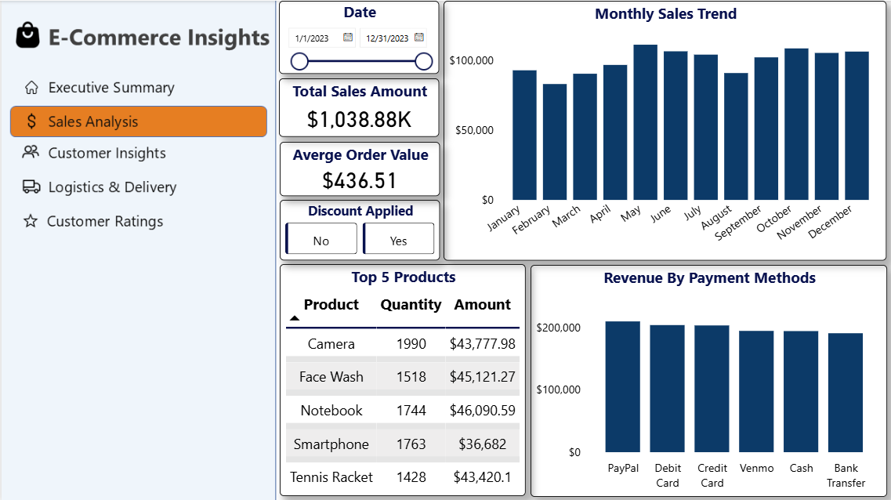
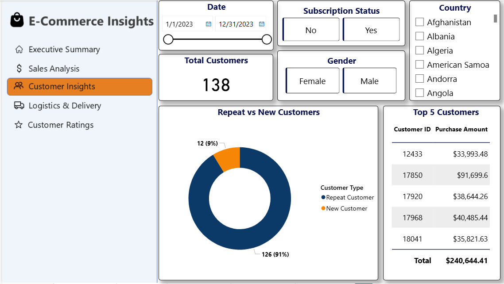
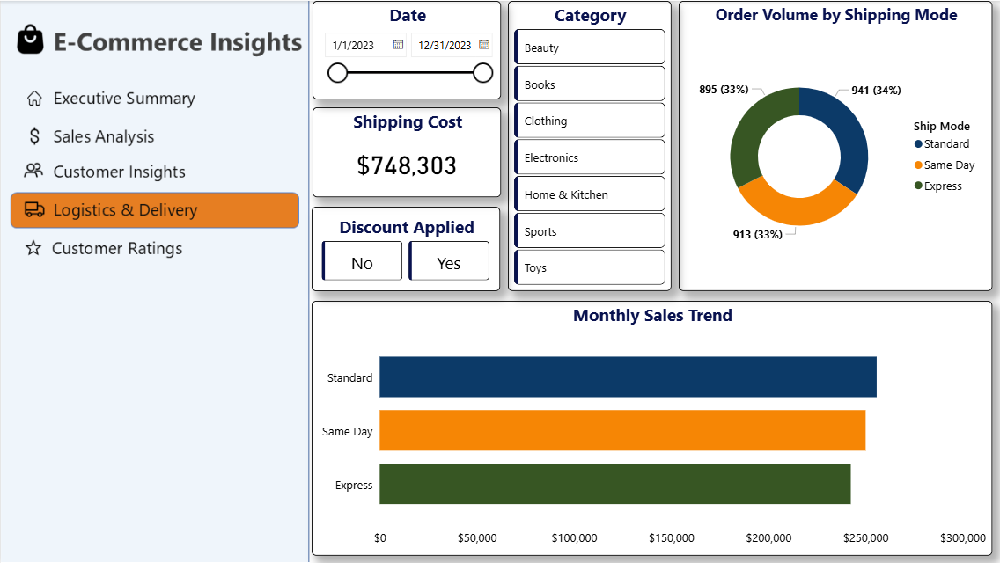
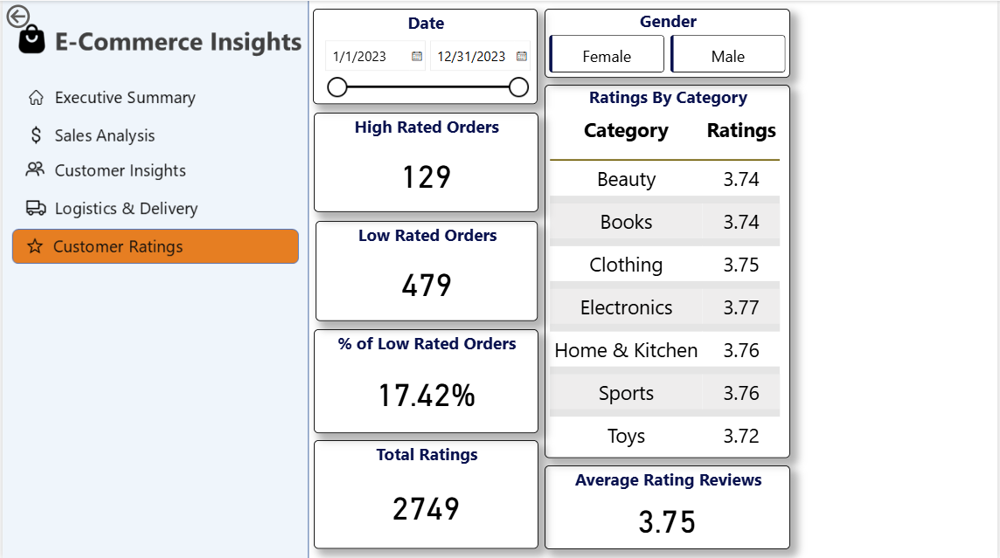

# E-Commerce Insights Project

## Overview

E-Commerce Insights is an end-to-end data analytics project focused on analyzing e-commerce business performance using data analysis and visualization techniques. The project aims to generate actionable business insights related to sales performance, customer behavior, logistics efficiency, and customer feedback to support data-driven decision-making.

## Dataset

The dataset used in this project is a CSV-based e-commerce dataset containing information about:

* Orders
* Customers
* Products
* Sales
* Shipping and delivery
* Customer feedback and ratings

The dataset was loaded and analyzed in Jupyter Notebook using Python libraries and SQL queries.

## Tools & Technologies

* Python
* Pandas
* NumPy
* MySQL
* Power BI
* Jupyter Notebook

## Project Workflow

### 1. Data Loading

* Imported CSV dataset into Jupyter Notebook using Pandas.
* Performed initial exploration and understanding of the dataset structure.

### 2. Data Cleaning & Preprocessing

* Handled missing values
* Removed duplicates
* Corrected data types
* Standardized column values
* Created derived columns for analysis

### 3. SQL Analysis

* Imported cleaned data into MySQL Server
* Wrote SQL queries to analyze:

  * Sales trends
  * Customer behavior
  * Product performance
  * Delivery performance
  * Customer feedback insights

### 4. Data Visualization & Dashboarding

Built interactive Power BI dashboards to visualize key business metrics and insights.

## Dashboards

### Executive Summary

Provides a high-level overview of:

* Total revenue
* Total customers
* Total orders
* Monthly sales trends
* Overall business performance
  


### Sales Analysis

Covers:

* Product category performance
* Revenue trends
* Best-selling products
* Sales growth analysis



### Customer Insights

Analyzes:

* Customer segmentation
* Customer purchasing behavior
* Repeat customers
* Customer distribution
  


### Logistics & Delivery

Focuses on:

* Shipping status
* Delivery performance
* Delayed orders
* Logistics efficiency
  


### Customer Ratings

Analyzes:

* Customer ratings
* Review trends
* Satisfaction analysis
* Feedback distribution
  


The dashboards provide clear and interactive visualizations that can help businesses improve operational efficiency and customer experience.

## How to Run the Project

### Clone the Repository

```bash
git clone <repository_link>
```

### Install Required Libraries

```bash
pip install pandas numpy mysql-connector-python
```

### Run Jupyter Notebook

Open the notebook in VS Code or Jupyter Notebook and execute the cells sequentially.

### Connect MySQL

* Import the cleaned dataset into MySQL Server
* Run the SQL queries provided in the project

### Open Power BI Dashboard

Open the `.pbix` file in Power BI Desktop to explore the interactive dashboards.

## Conclusion

This project demonstrates practical skills in data cleaning, SQL analysis, business intelligence, and dashboard development. It highlights the ability to transform raw e-commerce data into meaningful business insights using industry-standard analytics tools.
